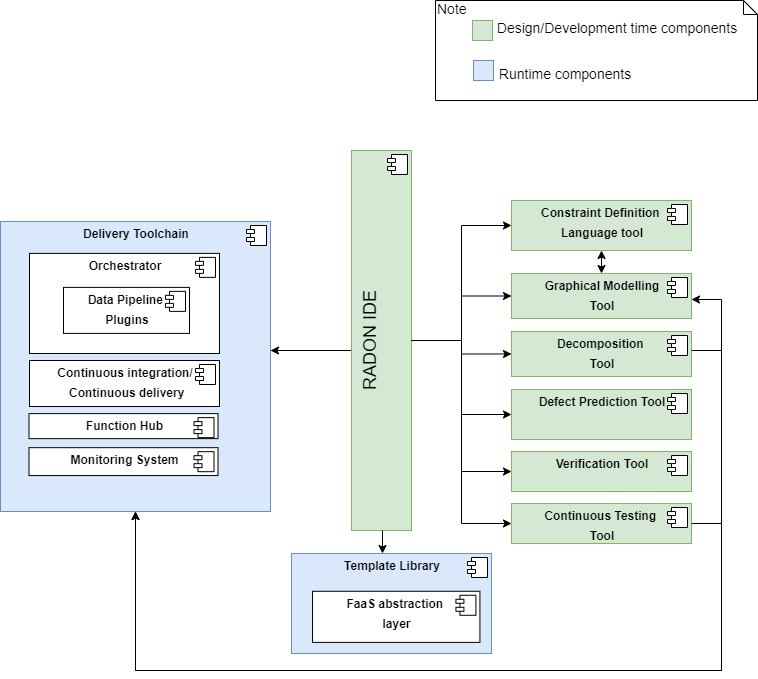
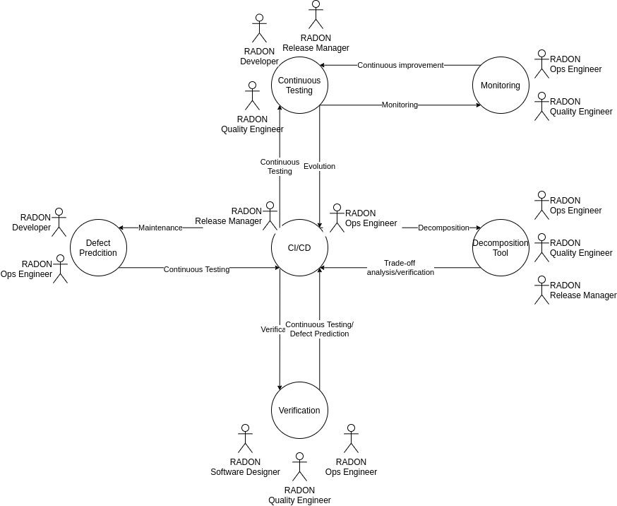

This repository acts as a knowledge base related to the RADON methodology, containing an overview and links to the RADON architecture, tools, actors and methodology.

Please check out the [RADON YouTube channel](https://www.youtube.com/channel/UCgoXX6JZ6bDqTxVBRm4KWnQ/videos) for videos!

# Introduction to RADON

If you are new to the framework, the [RADON booklet](https://radon-h2020.eu/wp-content/uploads/2021/07/RADON-Booklet.pdf) offers an holistic summary of the project results in its impacts in the domain of its use cases.

# Table of Contents
* [RADON Architecture](#radon-architecture)
* [RADON Actors and Stakeholders](#radon-actors-and-stakeholders)
* [RADON Methodology](#radon-methodology)
* [RADON Tools](#radon-tools)

# RADON Architecture

The RADON framework provides a set of components that realize a set of tools, modules and services covering both the design and runtime phases of microservices and serverless-oriented application development and deployment.

The Architecture Diagram depicts the connections among the RADON components. The design time components interact with each other and with the runtime components in order to design, prototype, deploy and test applications built on serverless FaaS. Such interaction(s) are defined by the [RADON Workflows](https://radon-h2020.eu/wp-content/uploads/2021/07/RADON-Booklet.pdf) in the context of the RADON methodology.

In this context a particular role is played by the RADON IDE. This component is be based on [Eclipse Che](#https://www.eclipse.org/che/) and provides a multi-user development environment to access the RADON artifacts. As depicted in the Architecture diagram, the RADON IDE interacts also with an important component called the Template Library. This components offers access to reusable base types, abstractions and TOSCA extensions and make them available to the RADON tools, that require them to model a RADON application. Moreover, the RADON IDE acts as the front-end of the RADON methodology, by enabling users to invoke RADON tools supporting both the design and runtime phases of application development.

For more information on the RADON Architecture, please refer to the deliverable document 
[D2.4 – Architecture & Integration Plan II](https://radon-h2020.eu/wp-content/uploads/2020/07/D2.4-Architecture-and-integration-plan-II.pdf)

# RADON Actors and Stakeholders

RADON delivers a DevOps-inspired methodology. On that basis, RADON proposes to identify a few reference DevOps actors. A RADON actor defines a role -- not a single human or software -- therefore the same person can potentially act as multiple RADON actors and the same role could be split across multiple actors. The RADON actors are as follows:

* Software Designer: this actor is responsible of the application architecture and data lifecycle design.
* Software Developer (Dev): responsible for business logic coding and testing.
* Operations Engineer (Ops): responsible for delivery on the infrastructure and infrastructure testing.
* QoS Engineer: responsibility for ensuring performance/reliability/security/privacy/access control properties of the application,
* Release Manager: team leader that authorizes major changes and their release to production.

For more information on RADON actors, please refer to the deliverable document [D2.2 - Final Requirements](https://radon-h2020.eu/wp-content/uploads/2020/07/D2.2-Final-requirements.pdf)

# RADON Methodology

The RADON DevOps methodology consolidates the user workflow for using RADON tools and the DevOps paradigm for software delivery and evolution. In the context of a DevOps lifecycle, we have defined several workflows as abstractions to organize and present the possible interactions of the different tools within the RADON framework and with the identified actors. DevOps actors as described above are fundamental to reason about the existing development and operations roles and re-assign them for the continuous delivery of software in the context of RADON. 

The table below depicts the RADON methodology, which is composed of six key RADON workflows triggered by the Application Development Entry-point. The RADON workflows methods impose structure on specific software development tasks with the goal of making the activity (more) disciplined, systematic, repeatable and predictable. The RADON tools have thus been designed for the explicit support of the RADON workflows, maximizing the level of automated support.

| RADON workflows | Roles | Tools |
| --- | --- | --- |
| [**The Entry-point: Application Development**](workflows/entry_point.md) | Software Developer Release Manager| Integrated Development Environment Graphical Modeling Tool Data Pipeline Plugin Function Hub Template Library Orchestrator |
| [**Verification Workflow**](workflows/verification_workflow.md) |Software Designer QoS Engineer | Verification Tool Graphical Modeling Tool Integrated Development Environment |
| [**Decomposition Workflow**](workflows/decomposition_workflow.md) |Software Designer Ops Engineer QoS Engineer |Decomposition Tool Graphical Modeling Tool Integrated Development Environment Monitoring Tool |
| [**Defect Prediction Workflow**](workflows/defect_prediction_workflow.md) | Software Developer Ops Engineer | Defect Prediction Tool Integrated Development Environment |
| [**Continuous Testing Workflow**](workflows/continuous_testing_workflow.md) | Software Developer Release Manager QoS Engineer | Continuous Testing Tool Integrated Development Environment Orchestrator Monitoring Tool |
| [**Monitoring Workflow**](workflows/monitoring_workflow.md) | Ops Engineer QoS Engineer | Monitoring Tool Integrated Development Environment Graphical Modeling Tool Orchestrator |
| [**CI/CD Workflow**](workflows/cicd_workflow.md) | Ops Engineer Release Manager | CI/CD Plugin Integrated Development Environment |

# RADON Tools

## Integrated Development Environment

| Items | Contents | 
| --- | --- |
| **Short Description** | The RADON IDE is based on Eclipse Che, and provides standard functionalities to support development activities (e.g. debugging functionalities and error checking capabilities) along with specific functionalities to achieve the RADON needs. It provides a shared space where different teams can access the RADON artifacts according to their authorizations and an access point for the interactions with the tools involved in the RADON architecture. | 
| **Documentation** | RADON Deliverables: [D2.3 – Architecture & Integration Plan I](http://radon-h2020.eu/wp-content/uploads/2019/11/D2-3_Architecture-and-integration-plan-I.pdf), [D2.4 - Architecture & Integration Plan II](https://radon-h2020.eu/wp-content/uploads/2020/07/D2.4-Architecture-and-integration-plan-II.pdf), [D2.6 - RADON integrated framework I](https://radon-h2020.eu/wp-content/uploads/2020/07/D2.6-RADON-integrated-framework-I.pdf), D2.7 - RADON integrated framework II |
| **Stand-Alone Tutorial** | https://radon-ide.readthedocs.io/en/latest/ | 
| **Video**| https://www.youtube.com/watch?v=__EumXU9ZNE |
| **Repository** | <ul><li>https://github.com/radon-h2020/radon-ide </li></ul> |
| **Latest DevFile** | https://raw.githubusercontent.com/radon-h2020/radon-ide/master/devfiles/radon/v0.0.3/devfile.yaml |
| **Licence**| Eclipse Public License, Version 1.0 (https://www.eclipse.org/legal/epl-v10.html) |
| **Contact**| <ul><li>Stefania D'Agostini ([@sdagostini](https://github.com/sdagostini))</li></ul> |

## Defect Prediction Tool

| Items | Contents | 
| --- | --- |
| **Short Description** | The Defect Prediction tool focuses on Infrastructure-as-Code (IaC) correctness. Recall that IaC is machine-readable code that manages and provisions infrastructure -- e.g., TOSCA or Ansible YAML files. The defect prediction tool helps RADON users to find suspicious defective Infrastructure-as-Code (IaC) scripts enabling DevOps operators to focus on such critical scripts before deployment and during Quality Assurance activities. | 
| **Documentation** | https://radon-h2020.eu/wp-content/uploads/2020/07/D3.6-Defect-prediction-tool-I.pdf |
| **Stand-Alone Tutorial** | https://radon-h2020.github.io/radon-defect-prediction-cli/ | 
| **Video**| https://tinyurl.com/y8mtyszm |
| **Repositories** |<ul><li>[APIs](https://github.com/radon-h2020/radon-defect-prediction-api) </li><li>[CLI](https://github.com/radon-h2020/radon-defect-prediction-cli) </li><li>[Plugin: VSC extension](https://github.com/radon-h2020/radon-defect-predictor-plugin)</li><li>[AnsibleMetrics](https://github.com/radon-h2020/radon-ansible-metrics)</li><li>[ToscaMetrics](https://github.com/radon-h2020/radon-tosca-metrics)</li></ul> |
| **Docs** |<ul><li>[CLI](https://radon-h2020.github.io/radon-defect-prediction-cli/)</li><li>[APIs](https://radon-h2020.github.io/radon-defect-prediction-api) <li>[AnsibleMetrics](https://radon-h2020.github.io/radon-ansible-metrics)</li></ul> |
| **Licence**| Apache License, Version 2.0 |
| **Contact**| <ul><li>Damian A. Tamburri (d.a.tamburri@tue.nl)</li><li>Stefano Dalla Palma (s.dallapalma@uvt.nl)</li><li>Dario Di Nucci (d.dinucci@uvt.nl)</li></ul> |

## Decomposition Tool

| Items | Contents | 
| --- | --- |
| **Short Description** | The decomposition tool is present to help RADON users in finding the optimal decomposition solution for an application based on the microservices architectural style and the serverless FaaS paradigm. It supports three typical usage scenarios: (1) architecture decomposition, (2) deployment optimization, (3) accuracy enhancement. | 
| **Documentation** | http://radon-h2020.eu/wp-content/uploads/2020/01/D3.2-Decomposition-Tool-I.pdf |
| **Stand-Alone Tutorial** | https://decomposition-tool.readthedocs.io/ | 
| **Video**| https://youtu.be/ZHD0t8HK7K0 |
| **Repository** | https://github.com/radon-h2020/radon-decomposition-tool |
| **Licence**| License |
| **Contact**| <ul><li>Lulai Zhu ([@zhululai](https://github.com/zhululai))</li><li>Giuliano Casale ([@gcasale](https://github.com/gcasale))</li></ul> |

## Constraint Definition Language and Verification Tool

| Items | Contents | 
| --- | --- |
| **Short Description** | The Verification Tool (VT) provides the functionality for verifying that the current RADON model conforms to the CDL specification defined by the CDL tool. The VT will be available as a plugin in the IDE, and will be supported by a “VT backend”, which will run in a container. In cases where the current RADON model does not conform to the CDL specification, the VT can be used to suggest corrections to the model. If the model does conform, the VT can be used to suggest improvements to it with respect to the preferences expressed as soft constraints in the CDL specification. The VT can also be used to find an optimal (preferred) completion of a partial RADON model, with respect to the CDL specification, and to learn new constraints for the CDL. | 
| **Documentation** | http://radon-h2020.eu/wp-content/uploads/2020/01/D4.1-Constraint-definition-language-I.pdf |
| **Stand-Alone Tutorial** | https://radon-vt-documentation.readthedocs.io/ | 
| **Video**| https://youtu.be/pJWetOzY2Zc |
| **Repository** | https://github.com/radon-h2020/radon-verification-tool |
| **Licence**| Please fill in this form to request a license: https://imperial.eu.qualtrics.com/jfe/form/SV_1HthWM3xILQM6ih |
| **Contact**| <ul><li>Mark Law (mark.law09@imperial.ac.uk)</li><li>Alessandra Russo (a.russo@imperial.ac.uk)</li></ul> |

## Continuous Testing Tool

| Items | Contents |
| --- | --- |
| **Short Description** | The Continuous Testing Tool (CTT) provides the functionality for defining, generating, executing, and refining continuous tests of application functions, data pipelines and microservices, as well as for reporting test results. While targeting to provide a general framework for continuous quality testing in RADON, a particular focus of CTT is on testing workload-related quality attributes such as performance, elasticity, and resource/cost efficiency. |
| **Documentation** | [D2.3 – Architecture & Integration Plan I](http://radon-h2020.eu/wp-content/uploads/2019/11/D2-3_Architecture-and-integration-plan-I.pdf) |
| **Stand-Alone Tutorial** | https://continuous-testing-tool.readthedocs.io/ |
| **Video**| https://youtu.be/35VN2edyvsc |
| **Source code** | <ul><li>https://github.com/radon-h2020/radon-ctt (CTT Server)</li><li>https://github.com/radon-h2020/radon-ctt-agent (CTT Agent)</li><li>https://github.com/radon-h2020/radon-particles (Includes CTT-related types)</li></ul> |
| **Licence**| [Apache License, Version 2.0](https://opensource.org/licenses/Apache-2.0) |
| **Contact**| <ul><li>Thomas F. Düllmann ([@duelle](https://github.com/duelle)) </li><li>Andre van Hoorn ([@avanhoorn](https://github.com/avanhoorn)) </li></ul> |

## Orchestrator

| Items | Contents | 
| --- | --- |
| **Short Description** | The orchestrator deploys the application into the runtime environment, enforcing the state described by application blueprint (CSAR) onto the targeted provider(s). The common operations are deployment, scaling and cleanup or un-deploy and are executed on different target environment as staging, development and production. | 
| **Documentation** | [User Guide and developers notes](https://xlab-si.github.io/xopera-docs/)/ RADON Deliverables: [D5.1](http://radon-h2020.eu/wp-content/uploads/2020/01/D5.1-Runtime-Environment-1.pdf), [D5.2]() |
| **Stand-Alone Tutorial** | https://xlab-si.github.io/xopera-docs/examples.html | 
| **Video**| <ul><li> [xOpera SaaS and Template Library overview - YouTube](https://www.youtube.com/watch?v=0hpKJ_LBlk8)</li><li> [xOpera SaaS with GUI - YouTube](https://www.youtube.com/watch?v=T4XviKWLc-A) </li><li> [xOpera SaaS with Eclipse Che - YouTube](https://www.youtube.com/watch?v=SIiLOe5dSqc) </li> <li> [xOpera CLI example - YouTube](https://www.youtube.com/watch?v=cb1efi3wnpw) </li> </ul>|
| **Source code and executables** | <ul><li> xOpera and xOpera API repository https://github.com/radon-h2020/xopera-opera </li> <li>xOpera CLI: https://pypi.org/project/opera/</li><li>xOpera API: https://pypi.org/project/opera-api/ </li><li>xOpera SaaS (proprietary) -> [Get in touch](https://saas-xopera.xlab.si/) </li></ul> |
| **Licence**|  <ul><li> xOpera core [Apache License, Version 2.0](https://github.com/radon-h2020/xopera-opera/blob/master/LICENSE) </li><li>xOpera SaaS -> [Get in touch](https://saas-xopera.xlab.si) </li> </ul> |
| **Contact**| <ul><li>Matija Cankar ([@cankarm](https://github.com/cankarm))</li></ul> |

## Data Pipeline Plugins

| Items | Contents | 
| --- | --- |
| **Short Description** | Data Pipeline plugin extends the orchestrator with the capability to control the life cycle of data pipelines, solving some of the technical issues related to transfering and securing data across heterogeneous cloud environments. | 
| **Documentation** | [D5.5: Data Pipeline Orchestration I](http://radon-h2020.eu/wp-content/uploads/2020/01/D5.5-Data-Pipeline-Orchestration-I.pdf) |
| **Stand-Alone Tutorial** | https://datapipeline-plugin.readthedocs.io/ | 
| **Video**| https://www.youtube.com/watch?v=_6zTEj2ZJ54 |
| **Repository** | <ul><li>https://github.com/radon-h2020/radon-datapipeline-plugin (Data pipeline plugin)</li><li>https://github.com/radon-h2020/demo-lambda-thumbgen-tosca-datapipeline (Data pipeline demo)</li></ul> |
| **Licence**| [Apache License, Version 2.0](https://opensource.org/licenses/Apache-2.0) |
| **Contact**| <ul><li>Chinmaya Dehury ([@chinmaya-dehury](https://github.com/chinmaya-dehury)) </li><li>Pelle Jakovits ([@pjakovits](https://github.com/pjakovits))</li><li>Satish Srirama [Satish Srirama](satish.srirama@ut.ee)</li></ul> |

## Template Library

| Items | Contents | 
| --- | --- |
| **Short Description** | The template library is a repository of application runtime management definitions including the blueprints, high-level system abstractions, application abstractions (including data pipeline components) and TOSCA language extensions. One of the specific parts of Template Library is the FaaS abstraction layer that holds the definitions required to deploy a particular application component to different cloud providers. | 
| **Documentation** | [User Guide](https://template-library-radon.xlab.si/docs/) / Deliverables: [D5.3](https://radon-h2020.eu/wp-content/uploads/2020/07/D5.3-Technology-Library.pdf), [D5.4]() |
| **Stand-Alone Tutorial** | https://template-library-radon.xlab.si/docs/gui.html | 
| **Video**| <ul><li> [xOpera SaaS and Template Library overview - YouTube](https://www.youtube.com/watch?v=0hpKJ_LBlk8)</li><li> [Template Library Publishing Service - CLI - YouTube](https://www.youtube.com/watch?v=28eTwojw5ac) </li><li> [Template Library Publishing Service - Eclipse Che - YouTube](https://www.youtube.com/watch?v=vCjfZ4Iue0E) </li> </ul>|
| **Access and tools** | <ul><li>RADON Particles: https://github.com/radon-h2020/radon-particles</li><li>Template library GUI: https://template-library-radon.xlab.si/ </li> <li> Template Library CLI: https://pypi.org/project/xopera-template-library/ </li> <li>API Documentation: https://template-library-xopera.xlab.si/swagger/ </li> </ul> |
| **Licence**| <ul><li> RADON Particles - [Apache License, Version 2.0](https://github.com/radon-h2020/radon-particles/blob/master/LICENSE) </li> <li> Template Library Publishing System - [Get in touch](https://saas-xopera.xlab.si) </li></ul> |
| **Contact**| <ul><li>Matija Cankar ([@cankarm](https://github.com/cankarm))</li></ul> |

## Graphical Modeling Tool (Eclipse Winery)

| Items | Contents | 
| --- | --- |
| **Short Description** | The Graphical Modeling Tool (GMT) is developed based on Eclipse Winery, which is a web-based environment to graphically model TOSCA-based application topologies. It includes (i) a component to manage TOSCA types and templates, (ii) a Topology Modeler that enables to graphically compose application topologies and specify configuration properties, and (iii) a file-based backend to store, import, and export TOSCA entities. | 
| **Documentation** | [User Guide](https://winery.readthedocs.io/) / RADON Deliverables: [D4.5](http://radon-h2020.eu/wp-content/uploads/2020/01/D4.5-Graphical-Modelling-Tools.pdf), [D4.3](http://radon-h2020.eu/wp-content/uploads/2019/11/D4.3-RADON-Models-I.pdf) |
| **Stand-Alone Tutorial** | [Getting Started](https://winery.readthedocs.io/en/latest/user/getting-started.html) | 
| **Video**| [Link](https://youtu.be/xEjarBWcdK0?t=81) |
| **Repository** | <https://github.com/radon-h2020/winery> (fork) / <https://github.com/eclipse/winery> |
| **Licence**| Dual licensed under the Apache License 2.0 and Eclipse Public License 2.0. |
| **Contact**| <ul><li>Michael Wurster (@miwurster, wurster@iaas.uni-stuttgart.de)</li><li>Vladimir Yussupov (yussupov@iaas.uni-stuttgart.de)</li></ul> |

## Delivery Toolchain

| Items | Contents | 
| --- | --- |
| **Short Description** | The delivery toolchain is a set of tools configured at one place with one goal - to deliver the application to the production site. To achieve the final step, delivery, with a success, a set of previous steps needs to be successfully accomplished. Delivery toolchain provides the single point of configuration management including CI/CD, monitoring and orchestration. | 
| **Documentation** | RADON Deliverables [D5.1](http://radon-h2020.eu/wp-content/uploads/2020/01/D5.1-Runtime-Environment-1.pdf), [D5.2]() |
| **Stand-Alone Tutorial** | https://radon-h2020.github.io/radon-delivery-toolchain/ | 
| **Video**| https://www.youtube.com/watch?v=rtMBcvVQdgI |
| **Repository** | https://github.com/radon-h2020/radon-delivery-toolchain |
| **Licence**| Apache License, Version 2.0 |
| **Contact**| <ul><li>Matija Cankar ([@cankarm](https://github.com/cankarm))</li></ul> |

## Function Hub

| Items | Contents | 
| --- | --- |
| **Short Description** | The Function Hub is a services for uploading, storing and sharing reusable FaaS. In the context of the RADON framework, it is used when creating FaaS objects in GMT. The function will be fetched when a .csar file is generated. | 
| **Documentation** | RADON Deliverables [D5.1](http://radon-h2020.eu/wp-content/uploads/2020/01/D5.1-Runtime-Environment-1.pdf) |
| **Stand-Alone Tutorial** | https://functionhub-cli.readthedocs.io | 
| **Video**| Comming |
| **Repository** | https://github.com/radon-h2020/radon-functionhub-client |
| **Licence**| CC BY-NC-ND 3.0 |
| **Contact**| <ul><li> Hans Georg Næsheim ([@naesheim](https://github.com/naesheim))</li></ul> |

