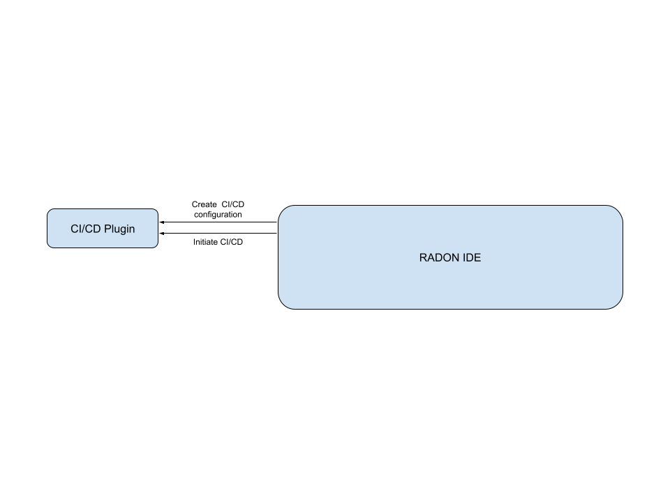
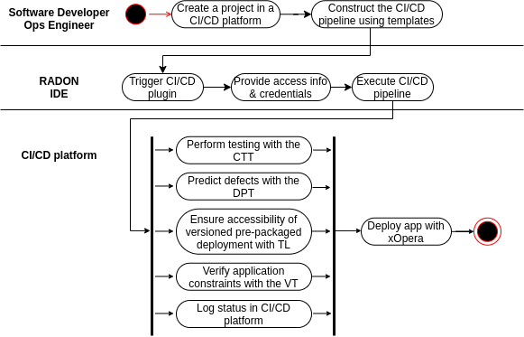

# Continuous Integration and Delivery Workflow

**Roles:** Ops Engineer, Release Manager

**Input:** Application specification

**Output:** A deployed serverless application

The Continuous Integration and Deployment Workflows play a pivotal role in the RADON lifecycle methodology, stitching together all other workflows. In particular,  during continuous code integration, novel code implementing add-on or modified functionalities are virtually-constantly fused with the existing serverless-computing IaC code base. During RADON's integration workflow, developers can use the RADON tools (e.g., defect prediction tool) for quality assurance.

RADON's continuous delivery lifecycle model phase helps speed up packaging and shipping new application features, reducing cycle time and feedback loops. In addition, by continuously deploying code snippets of limited size, introducing faults and errors can be significantly reduced, leveraging quality and maintainability.
The CI/CD Workflow plumbs together the different tools and artifacts to move from development to runtime stages by running the Builds and Tests in each step of the development process to ensure smooth integration and deploy the application to production. The workflow is backed by automation servers such as Jenkins and CircleCI.

In parallel to the regular application development, the OpsEng can create a CI/CD Pipeline using a selection of the RADON CI/CD templates available in a RADON repository. Based on the application's specification, the OpsEng can construct a CI/CD pipeline that:

* Performs appropriate application testing with the Continuous Testing Tool. 
* Verifies application constraints compliance with the Verification Tool.
* Analyzes the exported CSAR files and predicts code defects with the Defect Prediction Tool.
* Ensures accessibility of versioned pre-packaged deployment packages with the Template Library Publishing System.
* Deploys the application to production with the xOpera Orchestrator.
  
Once the Release Manager has approved the release, the OpsEng can use the GMT to export and release the TOSCA model(s) of the application that will reach the Orchestrator (e.g., xOpera) via the CI/CD Pipeline for instantiation on the target cloud(s). Information from the Monitoring System can be used to check the status of the deployed nodes.

