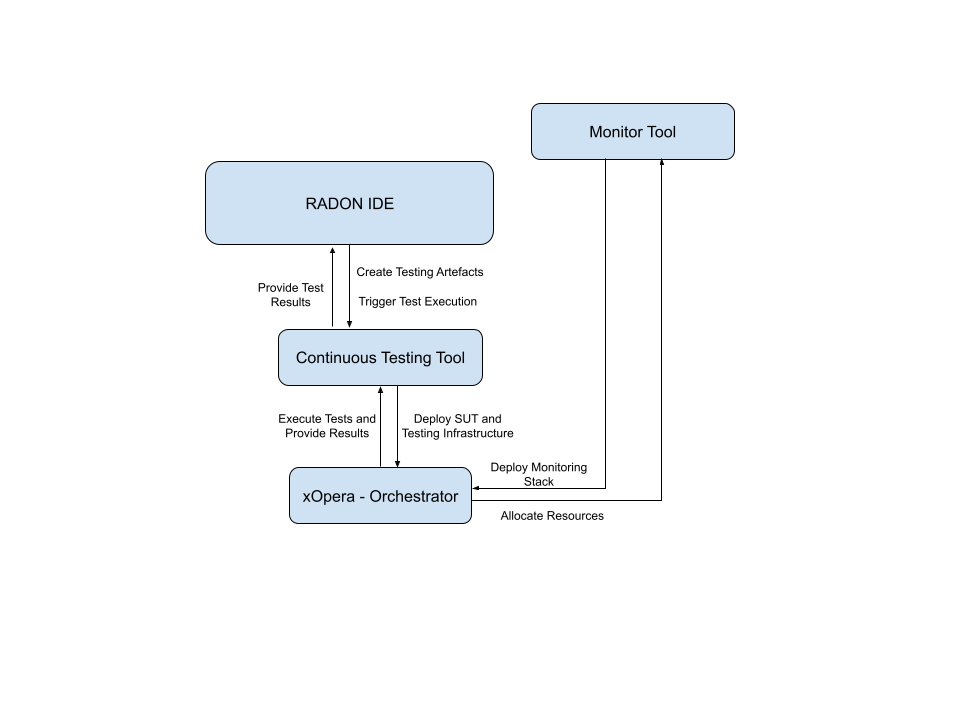
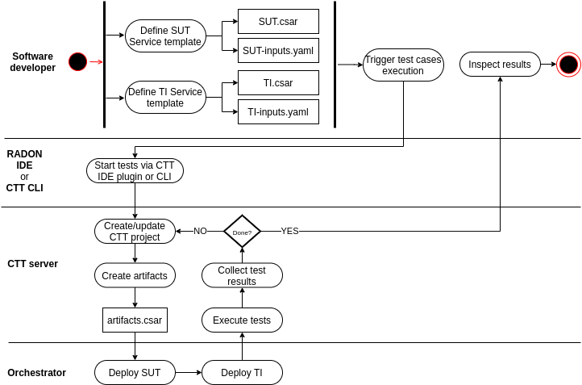
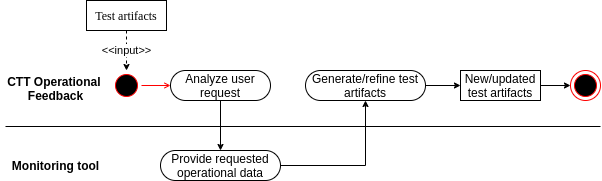

# Continuous Testing Workflow

**Roles:** Software Developer, Release Manager, QoS Engineer

**Input:** IaC blueprints and testing artifacts

**Output:** Test results

Testing is cumbersome and erroneous for developers and testers. Automated testing can continuously test the application, referred to as the system under test (SUT), and operate in a more consistent, precise, predictable manner. In this way, developing new test cases while reusing them in future similar serverless application contexts, and analyzing failed test cases, can be delivered quickly and with less effort in a pre-set timeline. In particular, the Software Developer and/or QoS Engineer can specify automatic test specifications for parts of the system under test. Once specified, release managers can let them be executed, after which test results may be inspected.

The Continuous Testing workflow leverages the Continuous Testing Tool, xOpera, and the Monitoring Tool. The workflow is integrated into the RADON IDE.

The continuous testing workflow comprises three usage scenarios, namely Define Test Cases (US 1), Execute Test Cases (US 2), and Maintain Test Cases (US 3).

Define Test Cases (US 1).  In parallel to the regular development, the Software Developer or QoSEng can define test specifications (e.g., deployment and load tests) for their application. The definition of test specifications is done via the RADON IDE by adding respective TOSCA policy types to the SUT’s service template. Moreover, the developer defines an additional service template for the test infrastructure (TI).  The resulting artifacts, comprising the SUT’s and TI’s CSAR files and input definitions, can be exported from the RADON IDE.

Execute Test Cases (US 2). During development or before deploying to production, actors such as the Developer or Release Manager can manually trigger the execution (via the RADON IDE or the standalone interface) or automatically (via CI/CD for integration into DevOps processes).  In each case, the Continuous Testing Tool conducts a series of steps for each selected test case, namely preparing the project context, generating executable artifacts (CSARs), deploying the SUT and the TI via the Orchestrator, executing the tests, and collecting the results. Afterward, the test results can be inspected.

Maintain Test Cases (US 3). Once the application is deployed in a production environment, operational data can be used to generate, refine, and select test cases, to fit into DevOps contexts, such as evolving system usage, limited test budgets in Continuous Integration/Deployment. Even though different approaches for maintaining test cases are provided in the continuous testing workflow, they share a similar process of analyzing the intended user request, querying the Monitoring Tool for the required monitoring data, and providing the generated/refined test artifacts.

