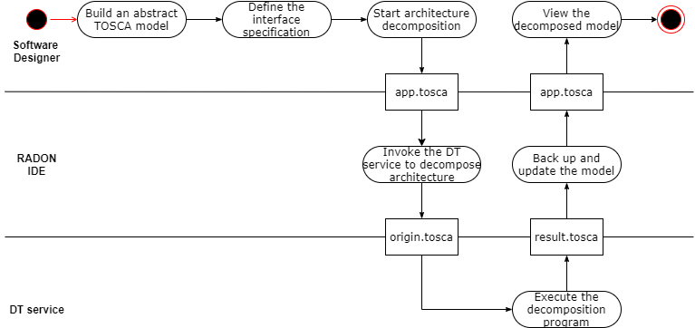

# Decomposition Workflow

**Roles:** Software Designer, Ops Engineer, QoS Engineer

**Input:** IaC blueprints, decomposition specification or runtime information

**Output:** A decomposed architecture

After defining the application architecture, the Software Designer has already laid down the first sketch of the application or imported an existing topology into the Graphical Modeling Tool. The Software Designer can get suggestions on how to decompose and map abstract components to concrete technologies. This task is supported by the Decomposition Tool (integrated into the RADON IDE). Furthermore, (s)he can decompose and adjust the application topology, e.g., to split a monolith first into microservices and then into serverless functions.

This workflow supports three classes of refinements: (1) architecture decomposition, (2) deployment optimization, and (3) accuracy enhancement.

1. Architecture decomposition​. This feature analyzes the topology of an application under development and suggests possible changes based on known architectural patterns, particularly breaking down a monolith into finer microservices or serverless functions.

2. Deployment optimization​. In this step, the RADON methodology aims to allocate concrete physical resources (e.g., memory, compute) under the constraint of fulfilling quality requirements, which may have been stipulated in a service level agreement.

3. Accuracy enhancement​. This feature enables the improvement of decomposition and optimization results through more accurate model parameterization using runtime data that represents how the serverless application actually works.

Next, the automatically generated decomposition suggestions and/or the revised TOSCA model are shared with the Software Designer or Operations Engineer (OpsEng). The previous version of the model will be saved using the Template Library.

Recall that the lifecycle of a RADON application is iterative. Thus, the QoS Engineer may decide to refactor the application based on new knowledge of its behavior observed from the Monitoring Tool. Such knowledge can enrich the TOSCA model in the form of new properties or constraints, enacting a feedback loop.

To optimize system performance and avoid bottlenecks in job placement, the Decomposition Tool can also use an interference estimation model to detect potential interferences of co-locating jobs in the system. This requires the Ops Engineer to define the workload specification in the TOSCA model and then start the execution of interference detection through the RADON IDE. The Decomposition Tool will feed performance metrics obtained from the Monitoring Tool to the interference estimation model and report any job interferences found to the Ops Engineer.

