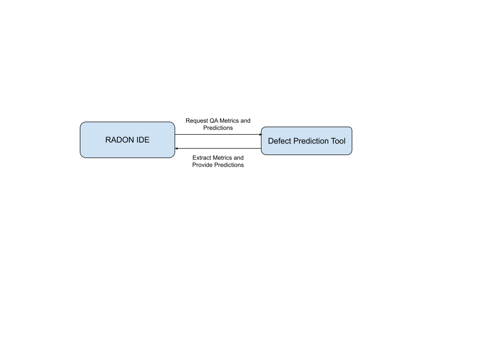
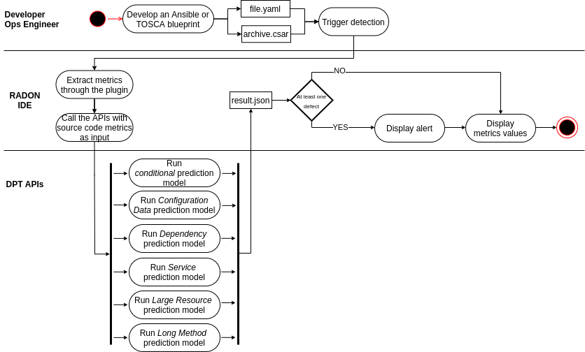

# Defect Prediction Workflow

**Roles:** Software Developer, Ops Engineer

**Input:** IaC blueprints

**Output:** Failure-proneness and IaC defect metrics

The defect prediction workflow is purposed to pinpoint RADON developers to those parts of the IaC blueprints that are potentially error-prone and deserve more attention from a testing perspective. In particular, the aim is to identify potential defects in infrastructural configuration management files.  To this end, the RADON methodology relies on a quality management approach that revolves around metrics applicable to IaC. In particular, to leverage the inspection of IaC scripts, the RADON methodology offers several pre-trained models and the option to train new detection models to the RADON developers, testers, and quality assurance staff. Supported by machine-learning developed models, the defect prediction workflow delivers a set of predictions and IaC metrics that help RADON developers, testers, and quality assurance staff to make informed decisions whether IaC scripts are error-prone or -free.

The Software Developer, who writes the application code, and the Ops Engineer, who creates and maintains the Infrastructure as Code scripts, can revisit/refactor the application code any time by invoking the Defect Prediction Tool through the RADON IDE. 

The Developer or Ops Engineer develops a blueprint in Ansible or TOSCA. They manually trigger the detection of potential defects in the resulting artifact (a YAML file for Ansible or a CSAR archive for TOSCA). 

Next, the following steps are performed automatically by the Defect Prediction Tool. Firstly, the appropriate metrics for the artifact at hand are extracted and subsequently passed to the API call for the prediction. In particular, it then runs five pre-trained models to effectively identify the respective defect types based on those metrics. 

The plugin provides immediate visual feedback to the Developer and/or Ops Engineer through the RADON IDE by (i) showing an alert explaining the prediction, in the case at least one defect type is found, and (ii) highlighting critical metrics that are higher than the community standard. 

Note that, for business logic, the developer can rely on standard debugging tools already available in the RADON IDE (e.g., linters).

