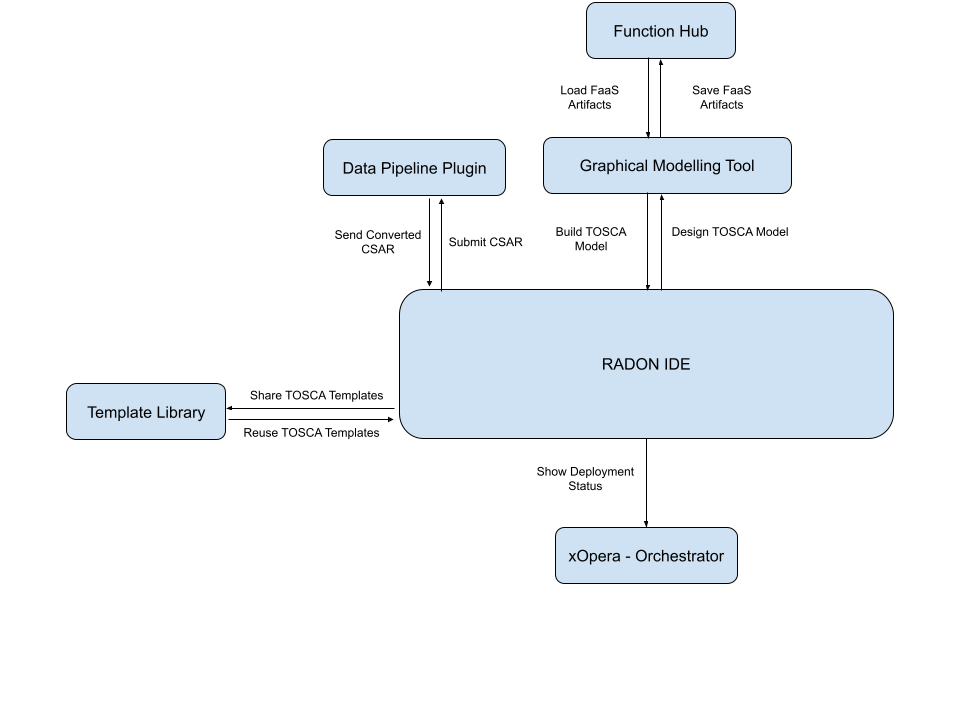

# The Entry-point: Application Development

**Roles:** Software Designer, Release Manager

**Output:** IaC Blueprint(s)

Through the RADON IDE, the Software Designer can access the Graphical Modelling Tool (GMT), which provides an end-user-friendly and graphical syntax agnostic modeling of TOSCA application topologies. To foster code reuse, ‘plug-and-play’ application artifacts (i.e., FaaS artifacts) can be saved and loaded using the Function Hub, a serverless package manager integrated with RADON through GMT. TOSCA service blueprint with data pipeline-based nodes may need to be updated at runtime to ensure consistency; therefore, RADON integrates the Data Pipeline plugin.

Developed TOSCA modules and blueprints can be stored, published, and shared via RADON Particles on Github or the Template Library Publishing Service.

The obtained service templates are compatible and compliant with the OASIS TOSCA standard, the older TOSCA XML, and the newer TOSCA YAML standard. Furthermore, GMT generates executable blueprints in the form of TOSCA Cloud Service Archives (CSARs). CSARs files can be orchestrated by the Release Manager using xOpera, the RADON orchestrator.

The application development is the starting point of the feedback loop that leads to high-quality blueprints through the workflows described in the following sections.