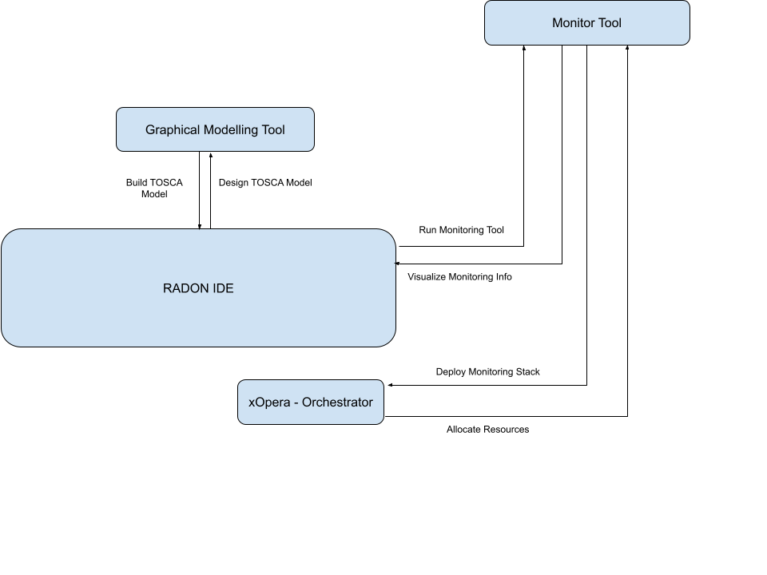

# Monitoring Workflow

**Roles:** Ops Engineer, QoS Engineer

**Input:** IaC blueprints

**Output:** Alerts generated when specific thresholds are violated

Monitoring the performance of the IaC blueprints is of critical importance to the all RADON lifecycle methodology roles, ranging from developers, testers, and integrators to quality engineers and release managers. During this lifecycle model phase, data is logged and recorded about the usage and performance of the RADON applications and IaC, continuously monitoring each functionality. Monitoring is directed through annotated TOSCA models to express which metrics (e.g., throughput) should be measured.

As such the monitoring workflow is instrumental in sustaining QoS, e.g., in terms of availability, scalability, security and performance of FaaS/micro-services in the RADON application. Exploiting this logged data threats and their root-causes can be detected and resolved in the continuous testing RADON lifecycle model phase.
The OpsEng sets up necessary monitoring support using simple annotations in the TOSCA models. The metrics to monitor will be defined by the QoSEng, ranging from resource utilization, throughput, and response time.

The Orchestrator deploys the nodes with the necessary logic to gather the monitoring metrics defined during development, gathered and stored in a monitoring database being maintained by the Monitoring System.

The application does not need to feature any complex control logic in the production Cloud environment, aside from some limited autoscaling form, thanks to pre-defined autoscaling rules (by the QoSEng) and the information gathered from the Monitoring System. Otherwise, such information would be used in the feedback loop to improve the suggested decompositions and optimizations by the Decomposition Tool and provide expected parameters for the Continuous Testing Tool.

