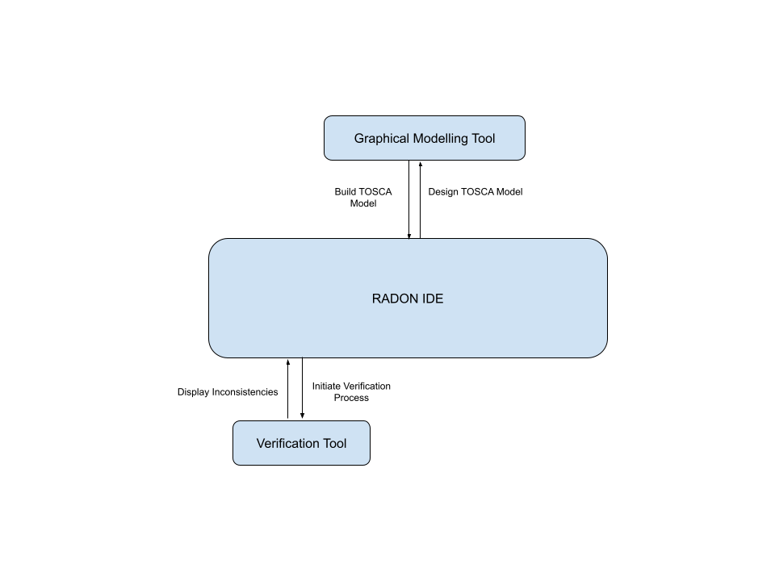

# Verification Workflow

**Roles:** Software Designer, QoS Engineer

**Input:** IaC blueprints and constraints defined using the Constraint Definition Language

**Output:** A list of the detected inconsistencies

The Software Designer commences in the Graphical Modeling Tool by graphically designing the main components of the application architecture (e.g., function(s), databases, data sources). After this, the Software Designer may annotate the model by setting desired properties and constraints (e.g., security/privacy requirements) in a Constraint Definition Language specification.  Model annotation is supported by the text editor in the RADON IDE.

Whenever the application architecture is updated, either the Software Designer or the QoS Engineer (QoSEng) can automatically verify whether the architecture conforms to the constraints expressed in the Constraint Definition Language specification. This is supported by the Verification Tool primary mode. When a violation is encountered (e.g., circular calls, privacy violations), the Software Designer has two options, to (i) open the corresponding artifact(s) (in the RADON IDE) for debugging; or (ii), to correct the Constraint Definition Language specification using the recommended corrections automatically suggested by the Verification Tool.

Some specific constraints from examples of valid and invalid architectures may be fed and then automatically learned by the Verification Tool (see deliverable 4.2). Rather than requiring a Software Designer to write constraints manually, they can instead define example architectures and use the Verification Tool to learn the constraints. A final conformance check can be performed by the Release Manager before deploying the application.

